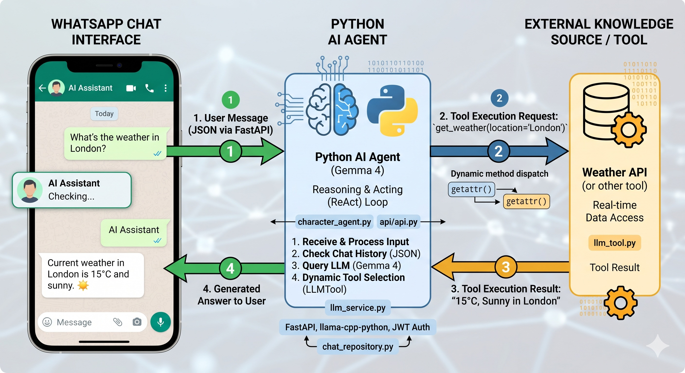

# Agentic AI showcase using a local LLM



Uses a local LLM to chat with AI characters.
A list of tools for responding to the message is provided to the LLM.
The list is dynamically generated using special decorators on class methods and reflection.
The LLM autonomously selects the appropriate tool and signals the invocation.
The program logic invokes the corresponding code via reflection and returns the result.
This enables fetching real-time information such as the weather or current time.

## Features

- Directly loads the model's GGUF file. No other servers or programs like ollama are required.
- Minimal dependencies. For inference, it only requires the llama.dll and the llama-cpp-python package.
- Supports all models, including abliterated or uncensored models.
- Privacy through local LLM: all data is processed locally, ensuring private chats stay private.
- Maximum performance by using CUDA and the new Blackwell NVIDIA features.

## Prerequisites

### Windows with NVidia GPU

- Visual Studio 2026 with the C++ workload must be installed.
- Install the CUDA Toolkit from https://developer.nvidia.com/cuda-downloads?target_os=Windows&target_arch=x86_64&target_version=11&target_type=exe_local
- Add the path to *C:\Program Files\NVIDIA GPU Computing Toolkit\CUDA\v13.2\bin\x64* (adjust version as needed) to the PATH variable.

```
nvcc --version
set CMAKE_ARGS=-DGGML_CUDA=on
set GGML_CUDA_FA_ALL_QUANTS=1
pip install llama-cpp-python --upgrade --force-reinstall --no-cache-dir
```

- Afterward, copy *cublas64_13.dll* and *cublasLt64_13.dll* from C:\Program Files\NVIDIA GPU Computing Toolkit\CUDA\v13.2\bin\x64 to C:\python\Lib\site-packages\llama_cpp\lib.

- **Optional:** Compile the llama CLI tool
    - Add *C:\Program Files\Microsoft Visual Studio\18\Enterprise\Common7\IDE\CommonExtensions\Microsoft\CMake\CMake\bin* to the path (for VS2026)
    - Instructions are available at https://github.com/ggml-org/llama.cpp/blob/master/docs/build.md#cuda. For safety, also set the environment variable *GGML_CUDA_FA_ALL_QUANTS* here.
    - Documentation at https://github.com/ggml-org/llama.cpp/tree/master/tools/cli

### macOS

Compile llama-cpp with the following option:

```
CMAKE_ARGS="-DGGML_METAL=on" pip install --upgrade llama-cpp-python
```

## Configure the API

Install the required packages using the following commands:

```
pip install --upgrade fastapi 
pip install --upgrade uvicorn
pip install --upgrade pydantic
pip install --upgrade PyJWT
pip install --upgrade python-dotenv
pip install --upgrade cryptography
```

### Creating the Certificates

Run the following command in the */api* directory.
This creates the necessary certificates for HTTPS.

```
python create_cert.py
```

### Download a model

Use a GGUF model file.
You can, for example, download the Gemma 4 E4B from Hugging Face using the following link: https://huggingface.co/lmstudio-community/gemma-4-E4B-it-GGUF/tree/main 
You only need the GGUF file.

If you have LM Studio, go to Models.
Use "Show in Explorer" to locate the GGUF file path and specify it in the .env configuration below.

### Creating the .env File

Create a file named _.env_ in the api directory with the following content:

```
SECRET_KEY="YOUR_SECRET"
MODEL_PATH="YOUR gguf FILE"
CORS_ORIGINS="https://my-name.github.io,http://localhost:5173"
DATA_DIR="data"
TOOLS_DIR="tools"

# Server Configuration
HOST="0.0.0.0"
PORT="8000"
SSL_KEYFILE="key.pem"
SSL_CERTFILE="cert.pem"
```

### Creating the settings.json File

In *DATA_DIR*, you can create a file named *system_config.json*.
It manages your models.
For example, it might look like this:

```json
{
    "active_model_id": "gemma-4-31B",
    "models": [
        {
            "id": "gemma-4-31B",
            "file_path": "C:\\Users\\Username\\.lmstudio\\models\\lmstudio-community\\gemma-4-31B-it-GGUF\\gemma-4-31B-it-Q4_K_M.gguf",
            "n_ctx": 32768
        },
        {
            "id": "Qwen3.6-27B",
            "file_path": "C:\\Users\\Username\\.lmstudio\\models\\lmstudio-community\\Qwen3.6-27B-GGUF\\Qwen3.6-27B-Q4_K_M.gguf",
            "n_ctx": 32768
        }
    ]
}
```

### Creating a User

A user can be created using the following command:

```
python create_user.py username password
```

## Building the frontend (Vue.js)

Navigate to the */frontend* directory and run the following commands:

```
npm install
npm run build
```

A combined index.html file will be written to the */docs* folder.
This can be hosted on GitHub Pages, for example.

## Extending with Custom Tool Classes

You can create *py* files in *TOOLS_DIR* that will be automatically loaded as tools.
The API recognizes methods decorated with *@llm_tool* and loads them.
The class must inherit from BaseTool.
Pay attention to the PyDoc comments.
They are passed to the LLM as part of the tool description.
Therefore, ensure you provide clear instructions to the LLM on when and how to use the tool and its parameters.
The method *_get_random_lines* in *BaseTool* reads a file and returns n random lines.

```python
from typing import List
from base_tool import BaseTool, llm_tool


class RoleplayTools(BaseTool):
    @llm_tool
    def get_scene_ideas(self, number_of_ideas: int) -> List[str]:
        """
        Retrieve random ideas for a new scene. 
        Use this when a scene change is appropriate or the user requests one.
        Hint: Request multiple ideas to select the one that best fits the current mood and outfit.
        """
        return self._get_random_lines("scene_ideas.txt", number_of_ideas)
```

> [!TIP]
> From the base class, the member variables *self.data_dir*, *self.config_manager*, and *self.llm_service* are available.
> You can use them when your tools need access to the configuration or the loaded LLM.